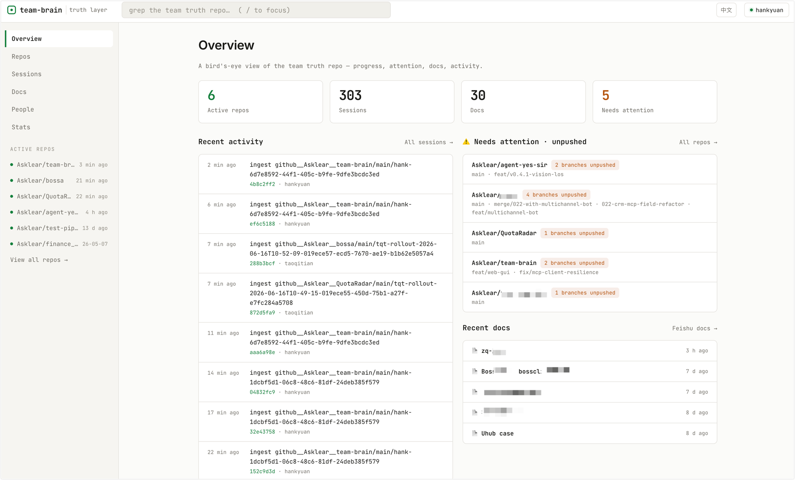
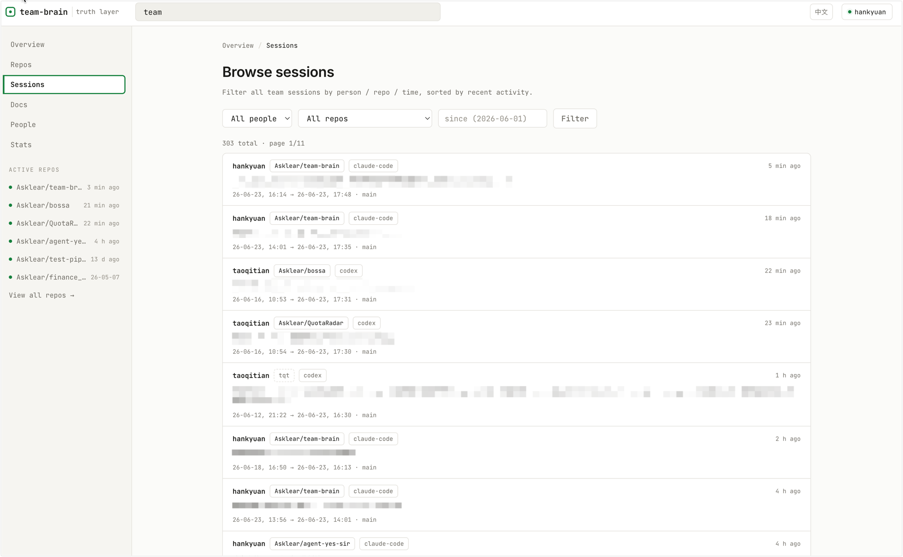
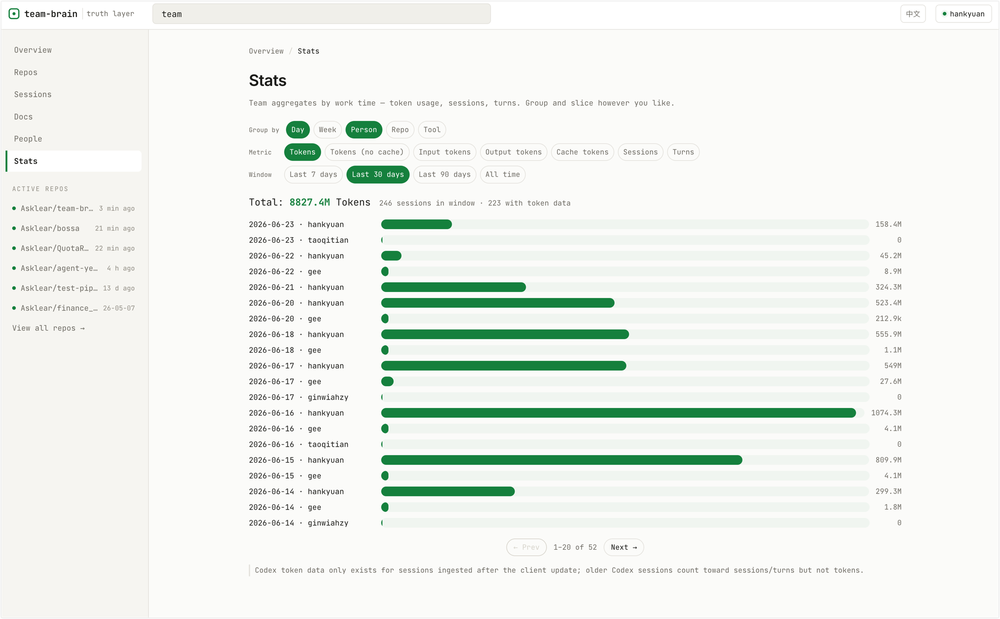

# Klear-Team-Brain

[](https://github.com/Asklear/Klear-Team-Brain/actions/workflows/ci.yml)
[](./LICENSE)
[](https://nodejs.org)

> **全队 AI 编程的共享记忆。** 自托管、极轻量，对干活的人零负担。

[English](./README.md) | 中文

---

## 它解决什么

你的团队用 Claude Code / Codex 干活，但**真正值钱的上下文——怎么想的、为什么这么改、踩了哪些坑——全锁在各人本地的 AI 对话里，关掉就没了。** 于是：

- 「这功能当初**为什么**这么设计？」翻遍 PR 也找不到——讨论发生在某人的对话里，不在 commit message。
- 「这个重构**谁在搞、做到哪了**？」只能挨个问人，或者等站会。
- 队友请假／离职，他上周的思路**跟着人一起断片**。

知识依赖“问到对的那个人”。人一忙、一走，上下文就断。

**Klear-Team-Brain 把全队的 AI 对话自动汇成一个共享的记忆库**，和 GitHub 代码现状、团队文档融在一起。然后你可以在编辑器里直接问，或在 Web 界面里浏览：

> 「鉴权重构做到哪了？」
> 「计费的 schema 当初怎么定的？」
> 「这周谁在动 ETL 那块？」

拿到的是综合了全队 **session + 代码 + 文档** 的答复，带依据。**干活的人啥都不用做，活就进了记忆库；想了解的人问一句、或点开看板就行。**



---

## 核心特点

- **零负担采集** — 大家照常用 CC/Codex，采集器在后台把 session 自动收进记忆库，无需任何手动操作。
- **两种查询入口** — ① 在编辑器里用自然语言问（MCP）；② Web GUI 看板浏览（按人／repo／时间筛 session、看进展与用量统计）。
- **极轻量、自托管** — 服务端就是 **一个 git 仓 + 一个 Node 进程 + 纯静态前端**：无数据库、无队列、无向量库，**一台小 VPS（低内存也能跑）** 就够。查询全走 `git grep`，**零服务器端 LLM 调用**——理解发生在你编辑器里的 Agent。
- **隐私优先** — 圈内白名单才上传，密钥上传前在客户端就脱敏；数据全留在你自己的基础设施里。

---

## 怎么用起来

**前置：** Node 22+；一个支持 MCP 的编辑器／CLI（Claude Code 或 Codex）用来提问。

> **不上 npm、也没有 SaaS——本就是自托管。** 没有公开包、没有托管服务：clone 这个仓来起服务器（或本地尝鲜），队友的客户端直接从**你的**服务器拉（`curl …/get | bash`）——见 [给团队部署](#给团队部署)。

### 先本地试一下（约 5 分钟——免 VPS、免 HTTPS、免邀请码）

想正式起服务器前先尝尝鲜？整套东西可以在你自己机器上单人跑起来：

```bash
git clone https://github.com/Asklear/Klear-Team-Brain.git && cd Klear-Team-Brain
npm install
npm run quickstart        # 一次性：签发本地身份 + token，把客户端指向 localhost，接好 MCP
npm run server            # 真相库服务跑在 http://127.0.0.1:8787 —— 这个终端别关，让它一直跑
```

然后**另开一个终端**收本机 session：

```bash
npm run sync -- --once    # 收一次（或 `npm run sync` 让它在后台持续盯着）
```

然后在编辑器里问，或打开 `http://127.0.0.1:8787/` 浏览。全程数据不出本机。想用容器起服务端？`docker compose up -d` 即可——见 [DEPLOY.md](./DEPLOY.md#docker)。

### 给团队部署

1. **起一台服务器**（一台小 VPS 即可）——手动，或用 `docker compose` 一条命令起。按 [DEPLOY.md](./DEPLOY.md)：装 Node、clone、设 `TRUTH_DIR`、配花名册 + token、前面套 HTTPS、跑成常驻。
2. **每个成员接入客户端**——指向你的服务器：
   
   ```bash
   curl -fsSL https://your-server.example.com/get | bash   # 下载客户端 + 注册 brain 命令
   brain join <你的邀请码>                                   # 校验 + 选工作空间 + 接 MCP + 首同步 + 装常驻
   ```
3. **开始用**——在编辑器里问，或打开 `https://your-server.example.com/` 浏览看板。

接入后，采集器常驻后台盯着你的 AI session，稳定一条就自动上传——**之后无需任何手动操作**。

---

## 两种查询方式

### ① 在编辑器里问（MCP）

接好 MCP 后，在 CC ／ Codex 里直接用自然语言提问（「鉴权重构做到哪了？」）。Agent 把记忆库当成一个**只读文件夹**，用几个 Unix 式原语去定位、读、综合，统一用相对 `path`：

| 工具            | 干啥                                                        |
| ------------- | --------------------------------------------------------- |
| `grep`        | 搜内容（git grep 正则全文）。默认搜脱敏 transcript；`raw=true` 连原始 jsonl。 |
| `find`        | 按文件名/glob 找文件（和 grep 互补：一个搜内容、一个搜文件名）。                    |
| `read`        | 按 path 读任意文件（大文件用 offset/limit 翻页）。                       |
| `ls`          | 看结构：有哪些 space、分支、几条 session。                              |
| `sessions`    | 按人 + 工作时间检索 session（某人某段时间干了啥）。                          |
| `stats`       | 按 天/周/人/repo/工具 聚合 token 用量 / session 数 / 对话轮次。           |
| `log`         | 活动时间线（git 历史；可按 space/author/since 收窄）。                   |
| `read_github` | 出网现拉 GitHub／GitLab／Gitea（含自建）某仓代码状态或文件最新内容（代码本体不入库）。       |

服务器侧查询全走 `git grep` ／ `git ls-files` ／ `git log` ／ `fs`——**execFile 无 shell、锁死在 `TRUTH_DIR` 内、只读**——**零服务器端 LLM 调用**。

> **接别的编辑器：** MCP 是个 stdio server，命令固定为 `<node> <安装目录>/mcp/server.mjs`（`brain mcp` 会打印你这台的实际路径）。任何支持 MCP 的客户端（Claude Code ／ Codex ／ Gemini CLI ／ Cursor ／ Cline ／ opencode…）加一个 stdio MCP server 即可。
>
> **远程／云端 agent（HTTP 传输）：** 跑不了本地 stdio 二进制的 agent，可改用 HTTP 挂载——指向 `https://你的服务器/mcp`，把个人 token 作为 `Bearer` 头带上即可。工具一样，无需本地安装。

### ② Web GUI 浏览

服务器在 `/` 直接托管一个**纯静态看板**（无需额外部署），适合不想敲提问、只想扫一眼的人：总览全队进展、按 人／repo／时间 筛 session、看 token 用量与活跃度统计、翻文档镜像。

**筛 session** —— 按人／repo／时间过滤，按最近活跃排序：



**用量统计** —— 按 天／周／人／repo／工具 聚合 token、session、轮次：



---

## 工作原理

```
每台机器(客户端)                          你的服务器(自托管)
┌────────────────────────┐            ┌──────────────────────────────────┐
│ ① 采集器 client/sync   │  gzip+token│ ② server/server.mjs(HTTP,前面    │
│   常驻,盯 AI session    │ ─────────▶ │   可套 Caddy 等做 HTTPS)          │
│   按白名单闸门只传圈内    │            │   /ingest → git 真相库 TRUTH_DIR   │
│                        │            │   + 每 4h 拉代码仓出 code-state    │
│ 查询 A: 编辑器里问(MCP)  │  搜+拉,综合  │   /grep /find /read /ls /log       │
│ 查询 B: 浏览器开 Web GUI │ ◀──────────│   + 在 / 托管纯静态看板            │
└────────────────────────┘            └──────────────────────────────────┘
```

记忆库是一个 **git 仓**，把三种料源融在一起——**每种东西长在哪，就从哪收：**

| 你想知道            | 主要长在               | 怎么进记忆库                           |
| --------------- | ------------------ | -------------------------------- |
| **进展 · 思考过程**   | CC/Codex session   | 蒸馏 + 脱敏后存全文 transcript           |
| **代码现状**        | GitHub／GitLab／Gitea（含自建） | 不存本体，查询时现拉 + 4h 轮询出 `code-state` |
| **目标 · 决策（人写）** | 团队文档（飞书/Lark wiki · Notion · Google Docs） | 正文单向镜像，可搜可读；改去源文档                |

> **设计取舍：** 只有“真相”（原料 + 元数据）被认真存、保持干净——因为它贵且不可重建；“视图”（查询／索引／看板）随时可换可丢。session 以**蒸馏**形态入库（剥内联图片、截巨型 tool 输出，存信号不存字节），字节精确的原文留在产出者本机（`~/.codex` ／ `~/.claude`）。

---

## 隐私与安全

- **范围闸门：** 只有 session 的 cwd 在你本机 `upload_folders` 白名单内才上传——圈内默认共享、圈外默认私有。
- **脱敏：** 上传前在客户端就抹掉密钥/token + 家目录路径，服务器投影 `.md` 和 `/read` 出口再各兜底一次。每个生产者还能维护一份**个人脱敏词表**（客户名、代号…），上传前先抹掉。
- **生产者透明可控：** 跑 `brain viewer` 打开本机控制台（127.0.0.1，仅你可见），逐条看每个 session 到底传了什么、跳过了什么——可逐条排除、把已进共享库的**撤回**、或加个人脱敏词。
- **凭证不入库：** 成员 token、GitHub PAT、文档源凭证都住服务器、都 gitignore；花名册（不含密钥）可提交。
- **记忆库就是全部价值——别 push 到任何公开 remote，并定期备份。** 自托管在只对圈内开放的基础设施上。

> **状态：** 早期、自托管、单租户。你自己跑服务器，数据不出你的基础设施。

---

## 可选：镜像团队文档（Lark / 飞书）

如果团队把人写的文档（目标、决策、笔记）放在 Lark/飞书 **wiki 知识库**，服务器可以把正文**单向镜像**进记忆库，让提问的 Agent 能像翻 session 和代码一样 `grep`／`read` 它们。一次性配好：

1. **建自建应用：** 在 Lark/飞书开放平台后台创建*企业自建应用*，记下 **App ID** + **App Secret**。

2. **开通读 scope：** 在「权限管理」加 `docx:document.readonly`、`drive:drive.readonly`、`wiki:wiki.readonly`，然后发布版本、等管理员通过。（不用开搜索 scope——镜像在本地搜。）

3. **把应用授权到整个知识库——这步最隐蔽，也是真正决定能不能访问的一步。** tenant token 的应用只能看到被显式加进去的知识库，而后台 UI 不能直接搜应用加，得绕一下：
   
   1. 建一个群。
   2. 把**本应用的机器人**加进群——必须是*同一个 App ID* 的机器人（加错机器人是最常见的失败原因）。
   3. 在知识库 **设置 → 成员设置 → 角色与权限 → 管理员 → 添加管理员**，把**这个群**加进去。
   
   应用就拿到了**整个知识库**的读权限（改完有 ~1–2 分钟传播延迟）。

4. **凭证放服务器：** 把 `feishu.example.yaml` 复制成 `feishu.yaml`（含密钥 → 已 gitignore），填好 `app_id` ／ `app_secret`，重启服务。不配则文档层安静关闭。

5. **验证：** 一个轮询周期后，文档会出现在记忆库 `feishu/<知识库>__<id>/…` 下，可用 `grep` 搜到。

> 国内飞书（`open.feishu.cn`）与国际版 Lark（`open.larksuite.com`）数据隔离——在你团队实际所在的平台建应用。以后每**新建**一个知识库，都要对它重复第 3 步，否则大脑看不见。

### 其它文档源（Notion · Google Docs）

文档镜像是**可插拔多源**的——所有源共用同一套同步引擎（`server/docsync.mjs`），每个源只是一个小 adapter（`core/<源>.mjs` + `server/<源>docs.mjs`）。现已多支持两个源，各由自己的 `*.yaml` 把关（不建即不启用），都遵循"把内容 share 给机器人、它就镜像"的模型：

- **Notion** —— 在 <https://www.notion.so/my-integrations> 建一个 *internal integration*（只读）；把页面/数据库 **share** 给它（页面 → ••• → *Connections*）；复制 `notion.example.yaml` → `notion.yaml`，填 `api_token`，重启。页面落到 `notion/<workspace>/…`。
- **Google Docs** —— 建一个 *service account*（启用 Drive API），下载 JSON key，把文档/文件夹 **share** 给该 service account 的邮箱（只读）；复制 `google.example.yaml` → `google.yaml`，指向 key，重启。文档落到 `google/<workspace>/…`。（认证用自签 JWT，不引入额外 SDK。）

没 share 的页面/文档看不到（share 才是真正的授权闸）；子页面、文件夹内容继承。一轮后即可 `grep` 搜到。

> Confluence 可按同一 adapter 范式接入——欢迎贡献。

---

## 更新日志

每版改了什么见 [更新日志](./docs/CHANGELOG.zh-CN.md)（[English](./docs/CHANGELOG.en.md)）。

## 非目标

它汇聚并帮你理解 CC/Codex session + GitHub + 文档里的东西。它**不是** IM ／ 项目管理 ／ 代码托管，也不取代它们。

## 参与贡献

欢迎 Issue 和 PR——见 [CONTRIBUTING.md](./CONTRIBUTING.md) 与 [SECURITY.md](./SECURITY.md)。本项目内部开发、镜像到此；外部贡献经 review 合入上游后再流出。

## 许可

[Apache-2.0](./LICENSE) © Asklear
